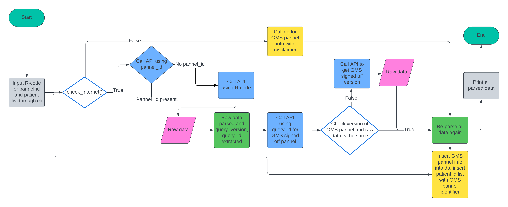

# PannelAppDB
PanelAppDB
============
PanelAppDB is a tool to search and store gene panel information for genetic tests included in the National Genomic Testing Directory.

- For help please use `-h` command

Functionality
---------------
Functionality provided by PanelAppDB include:
- Search for gene panel information by R code
- Generate BED file for gene panels
- Search for gene panels used for specific patients

ReadTheDocs documentation available at: https://softeng-module.readthedocs.io/en/main/ 

## Install via conda
```bash
git clone https://github.com/Fr3dMer/softeng_module.git
conda env create -n PanelAppDB --file environment.yml
conda activate PanelAppDB
mkdir db
```

## Install via pip
- This section has been added to satisfy the rebric 
```bash
git clone https://github.com/Fr3dMer/softeng_module.git
# Recommend creating venv or conda environment and activating it before carrying out this step
pip install -r docs/requirements.txt
mkdir db
```
## Running script localy using conda environment above in normal mode
```bash
conda activate PanelAppDB
mkdir db
python PanelAppDB.py -r R45 -g 123 -pid 123 -sid 456 -f 'db/'
```
## Building and running script inside container 
```bash
sudo docker build --rm -t "panel_app_db" .
sudo docker run --rm panel_app_db <PARAMS HERE>
# example
sudo docker run --rm panel_app_db -p 3 -g 123 -pid 123 -sid 456 -d 
```

## Running script localy using conda environment above in debug mode
```bash
conda activate PanelAppDB
mkdir db
python PanelAppDB.py -r R45 -g 123 -pid 123 -sid 456 -d -f 'db/'
```


## Tests
To run tests, run the following command in root:
```bash
pytest test/
```


## Structure of app



## Licence
### MIT Licence
Copyright 2024 Fredrick, Abi, Amy

Permission is hereby granted, free of charge, to any person obtaining a copy of this software and associated documentation files (the “Software”), to deal in the Software without restriction, including without limitation the rights to use, copy, modify, merge, publish, distribute, sublicense, and/or sell copies of the Software, and to permit persons to whom the Software is furnished to do so, subject to the following conditions:

The above copyright notice and this permission notice shall be included in all copies or substantial portions of the Software.

THE SOFTWARE IS PROVIDED “AS IS”, WITHOUT WARRANTY OF ANY KIND, EXPRESS OR IMPLIED, INCLUDING BUT NOT LIMITED TO THE WARRANTIES OF MERCHANTABILITY, FITNESS FOR A PARTICULAR PURPOSE AND NONINFRINGEMENT. IN NO EVENT SHALL THE AUTHORS OR COPYRIGHT HOLDERS BE LIABLE FOR ANY CLAIM, DAMAGES OR OTHER LIABILITY, WHETHER IN AN ACTION OF CONTRACT, TORT OR OTHERWISE, ARISING FROM, OUT OF OR IN CONNECTION WITH THE SOFTWARE OR THE USE OR OTHER DEALINGS IN THE SOFTWARE.


